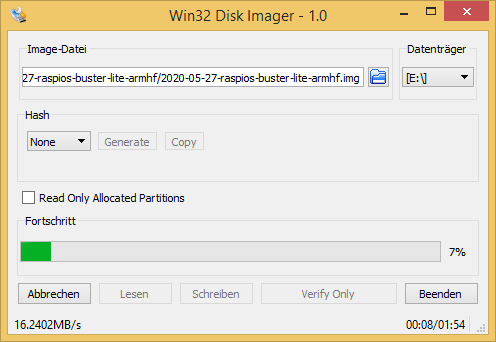
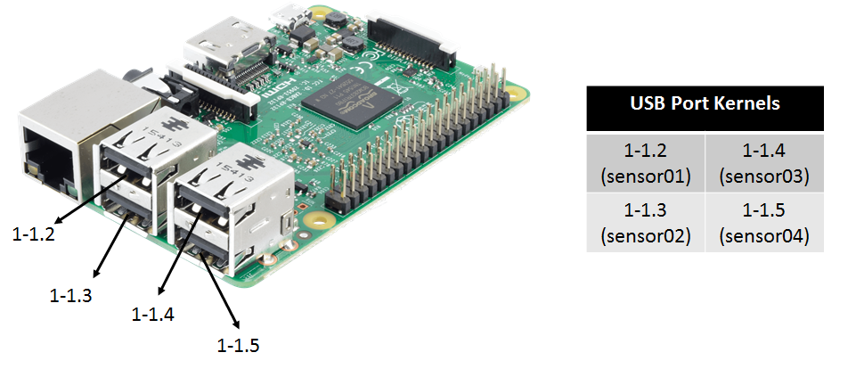

# Raspberry Pi for Mobile Robots

This is a tutorial on how to set up your Raspberry Pi for controlling a mobile robot. Therefore, we will use the Robot Operating System (ROS) together with different connection possibilities (e.g. WLAN, Mobile Net, ...).

A complete Image with existing ROS installation and WLAN access point can be found [here](https://drive.google.com/file/d/14kYuFTbEE-RQ3aikde9BUBpjqiKg_Hy9/view?usp=sharing). It has everything installed and configured until including the [WLAN Configuration](#WLAN) section.


## Table of Contents  

[Install Raspberry Pi OS](#instalOS) <br/>

[Access the Raspberry Pi](#Access) <br/>

[ROS Configuration](#ROS) <br/>

[WLAN Configuration](#WLAN) <br/>

[External WLAN Connection](#ExtWLAN) <br/>

[Enable SPI and UART Connection](#UART) <br/>

[Define static addresses for USB ports](#USB) <br/>

[Mobile Web](#Web) <br/>

[ROS over Mobile Web](#ROSWeb) <br/>

[Video for Linux (V4L) and ROS](#Video) <br/>

[Eigen3 Installation](#EIGEN) <br/>


## Install Raspberry Pi OS <a name="instalOS"></a>

First, we install Raspberry Pi OS onto the Raspberry Pi. There are different Images available (e.g. desktop, Lite) which can be found [here](https://www.raspberrypi.org/downloads/raspberry-pi-os/). We will use the Lite version to not burden our robot with unnecessary computational load. Download the ZIP folder of your chosen Raspberry OS version and load it onto a Micro SD card (e.g. 32 GB). We use the Win32 Disk Manager (Windows), which can be found [here](https://www.chip.de/downloads/Win32-Disk-Imager_46121030.html). Therefore, unpack the downloaded ZIP folder (it contains an .img file of the OS), start the Win32 Disk Manager, choose the .img-file and the right data medium and start writing onto the SD card.

<p float="left" align="middle">
  
</p>


## Access the Raspberry Pi <a name="Access"></a>

To access the Raspberry Pi for installing required components, we first enable the SSH connection. Therefore, we connect a monitor and a keyboard to the Raspberry Pi, start it and login with the default username and password

```shell
username: pi
password: raspberry
```

To enable SSH connection, we type

```shell
sudo raspi-config
```

navigate to Interfacing Options, then to P2 SSH and enable the SSH server option. Now we can connect via SSH, e.g. using [Putty](https://www.putty.org/). Therefore, connect the Raspberry Pi to your local network via ethernet. Probably, your Raspberry Pi has to be registered by your system administrator via its MAC address to get a valid IP. Now we can proceed with the further configurations, but first you might want to change your password by typing

```shell
passwd
```


## ROS Configuration <a name="ROS"></a>

To operate our mobile robot we will use the Robot Operating System ([ROS](https://www.ros.org/)). We start by updating and upgrading our system

````shell
sudo apt update
sudo apt upgrade
````

We now check the version of our Raspberry OS

````shell
cat /etc/os-release
````

It will show something similar to

````shell
PRETTY_NAME="Raspbian GNU/Linux 10 (buster)"
NAME="Raspbian GNU/Linux"
VERSION_ID="10"
VERSION="10 (buster)"
VERSION_CODENAME=buster
ID=raspbian
ID_LIKE=debian
HOME_URL="http://www.raspbian.org/"
SUPPORT_URL="http://www.raspbian.org/RaspbianForums"
BUG_REPORT_URL="http://www.raspbian.org/RaspbianBugs"
````

As you can see, our version is "buster". Hence, we can install the current ROS version Melodic onto our Raspberry Pi. To do so, we will follow [ROS Installation Tutorial]([http://wiki.ros.org/ROSberryPi/Installing%20ROS%20Melodic%20on%20the%20Raspberry%20Pi](http://wiki.ros.org/ROSberryPi/Installing ROS Melodic on the Raspberry Pi)) for the Raspberry Pi. We start by installing the repository key

````shell
sudo sh -c 'echo "deb http://packages.ros.org/ros/ubuntu $(lsb_release -sc) main" > /etc/apt/sources.list.d/ros-latest.list'
sudo apt-key adv --keyserver hkp://ha.pool.sks-keyservers.net:80 --recv-key C1CF6E31E6BADE8868B172B4F42ED6FBAB17C654
````

and updating the system

````shell
sudo apt update
sudo apt upgrade
````

Now, we install the bootstrap dependencies

````shell
sudo apt install -y python-rosdep python-rosinstall-generator python-wstool python-rosinstall build-essential cmake
````

We will proceed by downloading required files and building ROS-Melodic. First, we require a catkin workspace

````shell
mkdir -p ~/ros_catkin_ws
cd ~/ros_catkin_ws
````

to then fetch the core packages (no GUI-tools) and build them

````shell
rosinstall_generator ros_comm --rosdistro melodic --deps --wet-only --tar > melodic-ros_comm-wet.rosinstall
wstool init src melodic-ros_comm-wet.rosinstall
````

We proceed by resolving the dependencies (that should take a while)

````bash
rosdep install -y --from-paths src --ignore-src --rosdistro melodic -r --os=debian:buster
sudo rosdep init
rosdep update
````

Now, after downloading the packages and resolving the dependencies, we can start building ROS by invoking catkin_make_isolated. It might be required that you decrease the compilation thread with the -j1 or -j2 option

````bash
sudo ./src/catkin/bin/catkin_make_isolated --install -DCMAKE_BUILD_TYPE=Release --install-space /opt/ros/melodic
````

Now source the ROS environment and also put it into the ~/.bashrc, such that it get sourced automatically  for every bash session

````bash
source /opt/ros/melodic/setup.bash
echo "source /opt/ros/melodic/setup.bash" >> ~/.bashrc
````

ROS is now completely set up. If you require additional packages, follow up [this procedure](http://wiki.ros.org/ROSberryPi/Installing ROS Melodic on the Raspberry Pi#Adding_Released_Packages).


## WLAN Configuration <a name="WLAN"></a>

In order to be able to access the Raspberry Pi in absence of any local network, we let the Raspberry Pi open a WLAN by itself. We can then easily control and monitor our mobile robot over this network, e.g. by using [ROS-Mobile](https://github.com/ROS-Mobile/ROS-Mobile-Android). First, we install required software

````shell
sudo apt install dnsmasq hostapd
````

Add network configuration to the default activated DHCP Client Daemon by opening the config file

````bash
sudo nano /etc/dhcpcd.conf
````

and including

````
interface wlan0
static ip_address=192.168.1.1/24
````

by saving the changes with ctrl+o and returning with ctrl+x. As you can see, we assign our WLAN-Interface a static IP, which might be essential for the use as DHCP- or DNS-Server. Now, we restart the DHCP client daemon

````shell
sudo systemctl restart dhcpcd
````

Check if both network interfaces are available with

````shell
ip l
````

It should appear something similar to

````shell
1: lo: <LOOPBACK,UP,LOWER_UP> mtu 65536 qdisc noqueue state UNKNOWN mode DEFAULT group default qlen 1000
    link/loopback 00:00:00:00:00:00 brd 00:00:00:00:00:00
2: eth0: <BROADCAST,MULTICAST,UP,LOWER_UP> mtu 1500 qdisc pfifo_fast state UP mode DEFAULT group default qlen 1000
    link/ether b8:27:eb:44:ba:d4 brd ff:ff:ff:ff:ff:ff
3: wlan0: <BROADCAST,MULTICAST> mtu 1500 qdisc noop state DOWN mode DORMANT group default qlen 1000
    link/ether b8:27:eb:11:ef:81 brd ff:ff:ff:ff:ff:ff
````

Next, we change the configurations for the DHCP-server and the DNS-cache, which both are included in the "dnsmasq" file.  We save a copy of the current file as backup and then open the file for adding our configurations

````shell
sudo mv /etc/dnsmasq.conf /etc/dnsmasq.conf_alt
sudo nano /etc/dnsmasq.conf
````

We add the following lines

````
# DHCP-Server active for wlan0
interface=wlan0

# DHCP-Server non-active for existing network
no-dhcp-interface=eth0

# IPv4-addresses and lease time
dhcp-range=192.168.1.100,192.168.1.200,255.255.255.0,24h

# DNS
dhcp-option=option:dns-server,192.168.1.1
````

Save and close again with ctrl+o and ctrl+x. Let us now test our configurations

````shell
dnsmasq --test -C /etc/dnsmasq.conf
````

Hopefully, it gives back now an "OK". Finally, we restart the dnsmasq, checking the status and enabling the autostart mode

````shell
sudo systemctl restart dnsmasq
sudo systemctl status dnsmasq
sudo systemctl enable dnsmasq
````

By checking the status, the service should be "Active". In the last step, we now configure the "hostapd". Therefore, we open

````shell
sudo nano /etc/hostapd/hostapd.conf
````

which should be an empty file. We add the following lines

````
# Interface
interface=wlan0

# WLAN-Configuration
ssid=myRobotWLAN
channel=1
hw_mode=g
ieee80211n=1
ieee80211d=1
country_code=DE
wmm_enabled=1

# WLAN-Encryption
auth_algs=1
wpa=2
wpa_key_mgmt=WPA-PSK
rsn_pairwise=CCMP
wpa_passphrase=12345678
````

Our WLAN has now the name myRobotWLAN and the password is "12345678". Since this file holds the WLAN password, we should only allow the user root to get access

````shell
sudo chmod 600 /etc/hostapd/hostapd.conf
````

Lets us now check if the "hostapd" can be successfully put into operation

````shell
sudo hostapd -dd /etc/hostapd/hostapd.conf
````

If successfully, it should not go back to command input and show the following two lines somewhere

````shell
wlan0: interface state COUNTRY_UPDATE->ENABLED
wlan0: AP-ENABLED
````

If it goes back to command input or puts out error message, multiple error sources are possible. One common mistake is that you did not specify the country in which you operate, such that WLAN in general is disabled. Therefore go to

````shell
sudo raspi-config
````

and enable the WLAN. To let the "hostapd" start in the background as daemon we open the default configurations

````shell
sudo nano /etc/default/hostapd
````

and add

````
RUN_DAEMON=yes
DAEMON_CONF="/etc/hostapd/hostapd.conf"
````

Finally, we take the "hostapd" in work with

````shell
sudo systemctl unmask hostapd
sudo systemctl start hostapd
sudo systemctl enable hostapd
````

We can check if everything is successful by typing

````shell
sudo systemctl status hostapd
````

where "active" and "loaded" should be stated. We can now access the WLAN "myRobotWLAN" and connect via SSH to our Raspberry Pi.

You can also find the presented tutorial [here](https://www.elektronik-kompendium.de/sites/raspberry-pi/2002171.htm) (it is in german).

## External WLAN Connection<a name="ExtWLAN"></a>

If you want the Raspberry to access an external WLAN instead of open an own one, just open

````shell
sudo nano /etc/network/interfaces
````

and add the WLAN specification

````shell
# External WLAN
allow-hotplug wlan0
iface wlan0 inet manual
wpa-ssid "WLAN-NAME"
wpa-psk "WLAN-PASSWORT"
````

Afterwards, restart the interface

````shell
sudo ifdown wlan0
sudo ifup wlan0
````

## Enable SPI and UART Connection <a name="UART"></a>

Some sensors might require UART or SPI connections. To enable those connections we can change the boot config file

````shell
sudo nano /boot/config.txt
````

and add the following lines

````
# This enables devices 0.0 and 0.1
dtparam=spi=on
dtoverlay=spi1-3cs,cs0_pin=16,cs1_pin=12,cs2_pin=6

# Enable UART
enable_uart=1
````

In addition, we have to enable serial devices in general by going into the configuration setup

````shell
sudo raspi-config
````

Go to interfacing options and enable serial connections.


## Define static addresses for USB ports <a name="USB"></a>

You might like to have static addresses for your USB ports, such that you can easily access them within your ROS nodes. To define these static addresses, we add a new file to the udev rules

````shell
sudo nano /etc/udev/rules.d/99-usb-serial.rules
````

and add there the following lines

````
SUBSYSTEM=="tty", KERNELS=="1-1.2", SYMLINK+="sensor01"
SUBSYSTEM=="tty", KERNELS=="1-1.3", SYMLINK+="sensor02"
SUBSYSTEM=="tty", KERNELS=="1-1.4", SYMLINK+="sensor03"
SUBSYSTEM=="tty", KERNELS=="1-1.5", SYMLINK+="sensor04"
````

That defines for the 4 USB ports of the Raspberry Pi the static addresses sensor01, ..., sensor04. Be sure that the correct quotes for the strings have been used. Below you can see the defined port declaration.

<p float="left" align="middle">
  
</p>


To apply the new rules we have to reload them with the udevadm manager as super user

````shell
sudo su
sudo udevadm control --reload-rules && udevadm trigger
exit
````

You can check a serial port by connecting a device and try to read from it, e.g.

````
cat /dev/sensor01
````


## Mobile Web <a name="Web"></a>

To allow the Raspberry Pi to connect to the Mobile Web, we can use the [Raspberry Pi 3G/4G & LTE Base HAT](https://sixfab.com/product/raspberry-pi-base-hat-3g-4g-lte-minipcie-cards/) together with a prepaid mobile SIMcard (e.g. Aldi Talk). Follow up [this tutorial](https://sixfab.com/ppp-installer-for-sixfab-shield-hat/) to get started. You require your APN, which would be for Aldi Talk

````
internet.eplus.de
````

You can test your internet connection by installing

````shell
sudo apt install dnsutils
````

and using "nslookup"

````shell
nslookup google.de
````


## ROS over Mobile Web <a name="ROSWeb"></a>

To allow ROS connections via the Mobile Web, we require a secure VPN network with one server and multiple clients. The computer on which the server is running should have a static IP address for the internet connection. We assume that the VPN server is hosted on a computer running Linux Ubuntu 18.04. We start by installing OpenVPN and easy-rsa

````shell
sudo apt install openvpn
sudo apt install easy-rsa
````

Easy-rsa is needed for generating all keys and certificates we require. Therefore, we copy the folder for the key generation to a suitable place

````shell
sudo cp -r /usr/share/easy-rsa /etc/openvpn/easy-rsa2
````

We now have to adapt the file "vars" in the easy-rsa2 folder

````shell
cd easy-rsa2
sudo nano vars
````

Here we have to change the following entries that they fit to out situation

````
export KEY_COUNTRY="DE"
export KEY_PROVINCE="Schleswig-Holstein"
export KEY_CITY="Luebeck"
export KEY_ORG="ROB"
export KEY_EMAIL="info@webmaster"
export KEY_EMAIL=info@webmaster
export KEY_CN=changeme
export KEY_NAME=changeme
export KEY_OU=changeme
export PKCS11_MODULE_PATH=changeme
export PKCS11_PIN=1234
````

Also we have to add the line

````
export KEY_ALTNAMES="Irgendwas"
````

We check now if the folder "keys" already exists, if not, we add it

````shell
sudo mkdir keys
````

Next, we change the name of the latest "openssl-x.x.x.cnf" to "openssl.cnf"

````shell
sudo cp openssl-x.x.x.cnf openssl.cnf
````

The above adapted file "vars" has to be now sourced

````shell
source ./vars
````

There will be a warning. Now we can generate the master certificate and key

````shell
sudo -E ./clean-all
sudo -E ./build-ca
````

 the "dh2048.pem" file

````shell
sudo -E ./build-dh
````

and the certificate and key for the server

````shell
sudo -E ./build-key-server server
````

Now we can generate the keys and certificates for the different clients

````shell
sudo -E ./build-key client1
sudo -E ./build-key client2
sudo -E ./build-key client3
````

Finally, we require to generate the Diffie-Hellmann-Parameter

````shell
sudo -E ./build-dh
````

For the client we need only the .key, the .crt and the ca.crt files. We can pack them and send them to our clients

````shell
tar -cf client1.tar client1.key client1.crt ca.crt
````

We now need to define a configuration file for the server, "server.conf", with

````shell
cd /etc/openvpn
sudo nano server.conf
````

Add into this file the following lines

````
dev tun
proto udp
port 1194
ca /etc/openvpn/easy-rsa2/keys/ca.crt
cert /etc/openvpn/easy-rsa2/keys/server.crt
key /etc/openvpn/easy-rsa2/keys/server.key  # This file should be kept secret
dh /etc/openvpn/easy-rsa2/keys/dh2048.pem
topology subnet
server 10.8.0.0 255.255.255.0
client-config-dir ccd
client-to-client
keepalive 1 10
cipher AES-256-CBC   # AES
comp-lzo no
persist-key
persist-tun
status openvpn-status.log
verb 4
````

We add also a directory "ccd" (client-config-directory) and add client files to define static IP addresses for each client

````shell
sudo mkdir ccd
cd ccd
sudo nano client1
````

where we add the following line

````
ifconfig-push 10.8.0.2 255.255.255.0
````

Here, the IP is the static IP attached to the client. Now we can run our server using

````shell
sudo openvpn server.conf
````

#### Cellphone as Client (Android)

We first generate a file named "client.ovpn"

````shell
cd  ~
nano client.ovpn
````

and add the following lines

````
client
proto udp
dev tun
remote server.ip 1194
resolv-retry infinite
persist-key
persist-tun
ca ca.crt
cert client1.crt
key client1.key
remote-cert-tls server
cipher AES-256-CBC
comp-lzo no
verb 3
````

where we insert the correct static server IP. We then copy this file together with the "client1.key", "client1.crt", "ca.crt" files to a chosen folder on our mobile phone. Then, download the "OpenVPN Connect" App and find the "client.ovpn" file. Now you can simply press the connect button and the connection to your server (if the server is running) should be established.

#### Raspberry Pi as Client

Install openvpn

````shell
sudo apt install openvpn
````

Generate a file called "client.conf"

````shell
cd /etc/openvpn
sudo nano client.conf
````

and add the following lines

````
client
proto udp
dev tun
remote server.ip 1194
resolv-retry infinite
persist-key
persist-tun
ca ca.crt
cert client1.crt
key client1.key
remote-cert-tls server
cipher AES-256-CBC
comp-lzo no
verb 3
````

where we insert the correct static server IP. Put the "client1.key", "client1.crt", "ca.crt" files into the "/etc/openvpn" folder. You can start now the connection using

````shell
sudo openvpn client.conf
````

#### Test the System 

In order to check if our system works for sending ROS messages, we can use a simple talker node. Therefore, download the [sample code](https://drive.google.com/drive/folders/1PC52Sx3O7vkILSU1u4OL9ehUbs8QH7KW?usp=sharing) onto one of your clients which consist of a ROS package, which should be placed into the "src" folder of a catkin workspace. Thus, we first create such a workspace and "src" folder

````
cd ~
sudo mkdir -p catkin_ws/src
````

Now put the "connection_test" package into this folder and compile

````
cd ~/catkin_ws
catkin_make
````

The accompanied bash script will set all required environmental variables and start our test launch file. Therefore, put this into your home folder, make it executable and start it. But before, adjust the IP according to your system, (e.g. for client1 it might be the 10.8.0.2, depending which static IPs you assigned)

````
./startConnection.sh
````

Now, we can try to listen to the chatter topic from a different client or from the server. Be aware, that you also have to set the correct IP address onto these system.

## Video for Linux (V4L) and ROS<a name="Video"></a>

Let's assume you have a V4L compatible camera which you can simply plug in to one of the USB ports of the Raspberry Pi. You can check whether the camera is correctly recognized by typing

````shell
ls /dev/video*
````

You should get some video devices as return, e.g. /dev/video0 or /dev/video1. The different devices stand for different output formats of the connected camera, e.g. MJPG or H.264. In order to check this as well as supported framerates and framesizes, type

```shell
v4l2-ctl --device=0 --list-formats-ext
```

#### Streaming via VLC

We can now feed forward the video stream via a VLC server installing first VLC 

````shell
sudo apt-get install vlc
````

and then using

````shell
cvlc -vvv v4l2:///dev/video0 --sout '#rtp{sdp=rtsp://:8554/}' :demux=h264
````

To get access to the stream, we can now open the VLC media player on any other device connected to the same network as the Raspberry Pi, open the Tab "media", open "open network stream" and insert

````
rtsp://141.83.19.37:8554/
````

#### Video to ROS

In order to feed forward video data to the ROS system, we can use "usb_cam" together with "compressed_image_transport". Unfortunately, ROS currently does not support the H.264 format such that we have to use the MJPG compression format. Start now by installing the required nodes following up [this procedure](http://wiki.ros.org/ROSberryPi/Installing ROS Melodic on the Raspberry Pi#Adding_Released_Packages) 

````shell
cd ~/ros_catkin_ws
rosinstall_generator usb_cam compressed_image_transport --rosdistro melodic --deps --wet-only --tar > melodic-custom_ros.rosinstall
wstool merge -t src melodic-custom_ros.rosinstall
wstool update -t src
rosdep install --from-paths src --ignore-src --rosdistro melodic -y -r --os=debian:buster
sudo ./src/catkin/bin/catkin_make_isolated --install -DCMAKE_BUILD_TYPE=Release --install-space /opt/ros/melodic -j1
````

After installing everything, we can then create a launch file

````shell
<launch>
  <node name="usb_cam" pkg="usb_cam" type="usb_cam_node" output="screen" >
    <param name="video_device" value="/dev/video0" />
    <param name="image_width" value="640" />
    <param name="image_height" value="480" />
    <param name="pixel_format" value="yuyv" />
    <param name="camera_frame_id" value="usb_cam" />
    <param name="io_method" value="mmap"/>
  </node>
</launch>
````

filling up the correct parameters which can be detected with above mentioned "cvlc".


## Eigen3 Installation <a name="EIGEN"></a>

Your might want to use Eigen3 as math library for some ROS nodes (e.g. a Kalman Filter). To install the Eigen3 package ...
